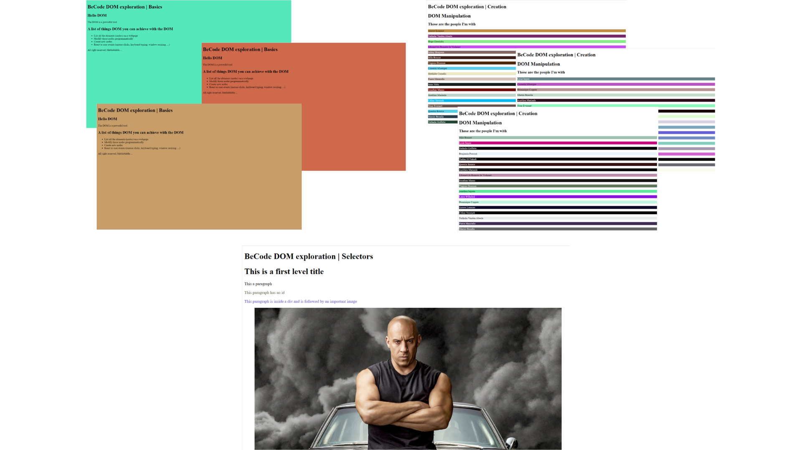

# DOM

In this repository we experiment with the DOM.

---

Project completed

This repository was created and edited on November 30, 2022. This project is an exercise realized during the training web developer junior given by Becode.org

---

## Language

- HTML
- JS

---

## How to install the repository locally

1. create a local working folder
2. open Git Bash
3. clone the repository
4. now you can work on the file
